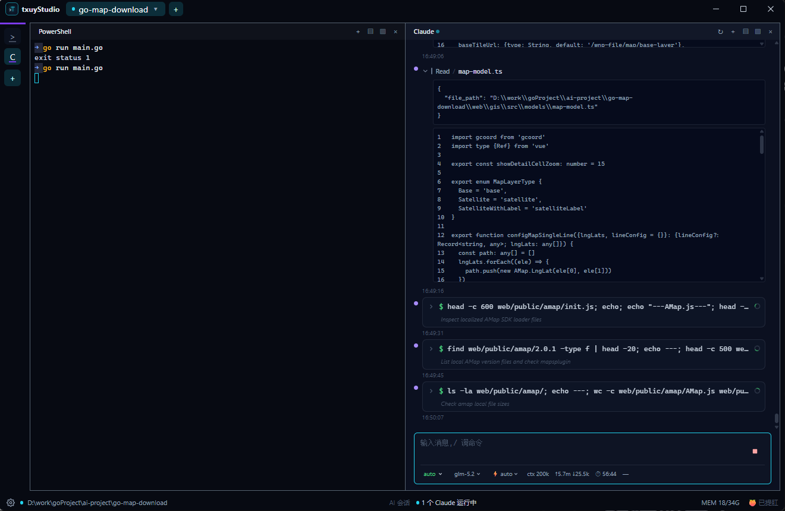
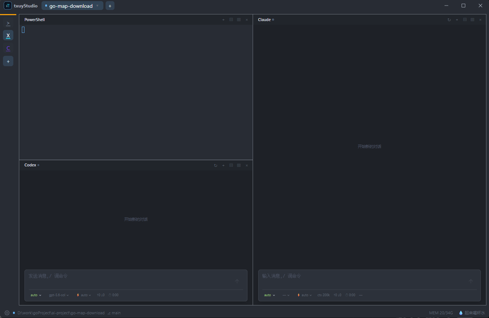
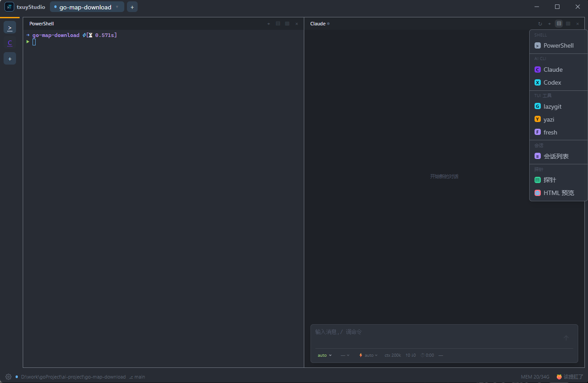
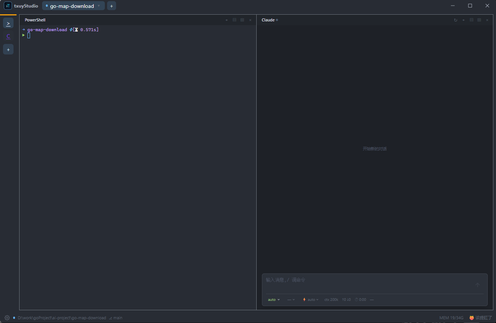

# txuyStudio

> 面向 Windows 开发者的 AI CLI 终端工作台 — 并行管理 `claude` / `codex` / 常规 shell / 测试命令的桌面工作台（Tauri · Rust · React · xterm.js）。

**Status: MVP** · 自渲染 Claude/Codex 对话面板 · 真实 PTY（按项目隔离）· 多项目多主窗口 · 可弹出独立窗口 · WT 式分屏（每 pane 多 tab）· 内置 oh-my-posh + Nerd Font · 布局持久化

[English](#english) · [中文](#中文)

---

<a id="english"></a>

## English

**An AI CLI terminal workspace for Windows developers.**

txuyStudio is a desktop workbench (built with Tauri + Rust + React + xterm.js) for running and managing AI CLI tools — `claude`, `codex`, regular shells, and test commands — side by side within a per-project workspace. It is **not** a general-purpose terminal replacement; the differentiation is a UI and workflow designed around AI-coding-CLI usage.

> **Status:** MVP — self-rendered Claude/Codex conversation panes, real PTY with per-project isolation, multi-project workspaces with multi-window support, detachable project windows, Windows-Terminal-style pane splitting with per-pane multi-tab, bundled oh-my-posh + Nerd Font, TUI tool windows (lazygit/yazi/fresh) with install prompts, WT-style shortcuts, and persisted layouts are all implemented. Destructive-command protection and one-click task launching are on the roadmap.

> To see it live: clone → `bun install` → `bun run tauri dev`.

### Screenshots

<p align="center">
  <br>
  <sub>Multi-project workspace with Windows-Terminal-style pane splitting, per-pane tabs, and a Claude conversation pane.</sub>
</p>

<p align="center">
  <br>
  <sub>Self-rendered Codex pane — inline message stream, tool-call cards, and a status bar with switchable sandbox.</sub>
</p>

<p align="center">
   &nbsp;&nbsp;
  <br>
  <sub>Left: pane focus / splitting. Right: built-in One Dark theme (terminal ANSI + UI surface).</sub>
</p>

### Highlights

- **Per-project workspace** — switch projects from the top bar; each project keeps its own shell layout and restores on reopen. PTY processes are isolated per project (closing a project kills its PTY).
- **Self-rendered AI conversation panes** — Claude & Codex each get a dedicated conversation UI (not a terminal): streaming markdown + thinking, tool-call cards with in-place approval (executes locally and feeds the result back), session-history resume, per-tab model / effort / permission-mode switching, context-window % status, `/compact`, and `!` inline PowerShell commands. The `claude` executable is auto-located — native installer (`~/.local/bin`, recommended), PATH, or legacy `~/.claude/local`.
- **Multi-window workbench** — the top-bar ＋ menu (new project / new window / recent projects) opens additional main windows with isolated projects; closing a project archives it to history, restorable in one click with its layout and AI sessions intact.
- **Detachable project windows** — right-click a project chip → "Open in new window" pops it into an independent native window (move semantics: hidden in main window while detached). Dock back or close the window to restore; detached state is runtime-only (not persisted), so restart always re-docks everything into the main window.
- **Windows-Terminal-style pane splitting** — split panes right/down (nestable), close-to-refill, directional focus switching. Binary `paneTree` model, persisted to `state.json`.
- **Per-pane multi-tab** — each pane leaf holds a stack of tabs (switch without disposing xterm; scrollback & input history preserved). Splitting (space) and tabs (time) are orthogonal dimensions.
- **Multiple shells per project** — open PowerShell, `claude`, `codex`, and TUI tools (`lazygit` / `yazi` / `fresh`) panes; uninstalled tools prompt with install commands (winget/scoop/npm) instead of silently failing.
- **Real PTY** — backend `portable-pty` (Windows ConPTY) with a pooled `TauriPtyTransport`; the UI never calls PTY commands directly.
- **Bundled prompt + font** — the app ships `oh-my-posh.exe` + a Tokyo Night theme + a Nerd Font (CaskaydiaCove NF), so the prompt renders consistently on any Windows machine without depending on the user's local setup.
- **WT-style shortcuts** — `Alt+Shift+-` / `Alt+Shift++` / `Alt+Shift+arrows` / `Alt+Shift+W` / `Ctrl+Shift+T` / `Ctrl+Shift+W` / `Ctrl+Tab` / `Ctrl+Alt+1…9` (switch project).
- **Status bar** — focused project path + git branch, live memory %, and a dismissible health reminder (hydration / Kegel) on a 30-min rotation.
- **Persisted Rust logs** — `tauri-plugin-log` writes to the app log dir (daily rotation), stdout, and the webview console.

### Tech Stack

| Layer | Tech |
|---|---|
| Shell / Desktop | Tauri 2.x (Rust backend) |
| Frontend | React + TypeScript + Vite |
| Terminal | `@xterm/xterm` + `@xterm/addon-fit` |
| Styling | Tailwind CSS v4 (`@tailwindcss/vite`) |
| PTY | `portable-pty` (Windows ConPTY) |
| Package manager | Bun |

### Project Layout

```
src/
  domain/         # Pure types & models (paneTree, sessions, transport interface, shellKinds, shortcuts)
  components/     # AppShell, TopProjectBar, ProjectColumn, ProjectTabs, ShellSidebar, PaneSurface, StatusBar, TerminalPane, WindowControls, SettingsModal, InstallPromptModal
  mock/           # Mock data (browser-only fallback)
src-tauri/
  src/
    pty/          # PTY registry (per-project buckets) + spawn/write/resize/kill commands
    state/        # AppState, persistence (state.json), pane-tree commands, window-aware hydrate
    system/       # Read-only env queries (memory %, git branch, tool-install detection)
    windows.rs    # Detachable project windows (open/close_project_window)
    lib.rs        # Tauri entry; registers plugins, commands & global window-event listener
```

### Prerequisites

- [Bun](https://bun.sh) (package manager & script runner — **npm/yarn are not used**)
- [Rust toolchain](https://rustup.rs) (Tauri backend)
- Windows (ConPTY-based PTY)

> Rust may not be on `PATH` in a fresh PowerShell session. Add it if needed:
> `$env:Path += ";C:\Users\<user>\.cargo\bin"`

### Getting Started

```powershell
bun install          # install dependencies
bun run tauri dev    # daily dev: launches Vite (:1420) + Tauri window
```

Other commands:

```powershell
bun run dev          # frontend only (browser, falls back to mock data)
bun run build        # frontend production build (tsc + vite build)
bun run tauri build  # full release build -> src-tauri/target/release/txuy-studio.exe
cargo check          # backend type/compile check (run inside src-tauri/)
```

The frontend dev server is pinned to port `:1420` (`strictPort`) — Tauri depends on it. If a stale process holds the port, kill it before launching.

### Keyboard Shortcuts (Windows-Terminal defaults)

| Key | Action |
|---|---|
| `Alt+Shift+-` | Split focused pane downward |
| `Alt+Shift++` | Split focused pane to the right |
| `Alt+Shift+↑↓←→` | Move focus to adjacent pane |
| `Alt+Shift+W` | Close focused pane (neighbor refills) |
| `Ctrl+Shift+T` | New tab in focused pane (copies current tab's shell kind) |
| `Ctrl+Shift+W` | Close current tab |
| `Ctrl+Tab` / `Ctrl+Shift+Tab` | Cycle tabs forward / backward |
| `Ctrl+Alt+1…9` | Switch to project N (by visible-project order) |
| `Ctrl+C` | Copy when text is selected in a terminal pane; otherwise send ^C (interrupt) |

> Right-click the top-bar project chip for "Open in new window" (detach) and other project actions. The gear in the bottom-left status bar opens the shortcuts/settings panel.

### Architecture Note

Terminal IO is decoupled behind a `TerminalTransport` interface (`src/domain/terminalTransport.ts`). `TerminalPane` depends only on this interface — it never calls Tauri PTY commands directly. Swapping backends means adding a new transport implementation; UI components stay unchanged.

### Roadmap

- Destructive-command protection (Remove-Item / `git reset --hard` / `git clean -fd` interception)
- One-click launch of Claude / Codex / test tasks (templated)
- Drag-to-resize pane ratios, pane maximize/restore
- Terminal output search & archive
- AI session status semantics (running / waiting input / failed / done)

Implementation progress and the roadmap are listed above; ongoing tracking moves to GitHub Issues over time.

---

<a id="中文"></a>

## 中文

**面向 Windows 开发者的 AI CLI 终端工作台。**

txuyStudio 是一个桌面工作台(基于 Tauri + Rust + React + xterm.js),用于在同一个项目工作区内并行运行和管理 AI CLI 工具——`claude`、`codex`、常规 shell、测试命令。它**不是**通用终端替代品,差异化在于为「AI 编程 CLI 工作流」专门设计的界面与流程。

> **当前阶段:**MVP——自渲染 Claude/Codex 对话面板、真实 PTY(按项目隔离)、多项目多主窗口工作区、可弹出独立项目窗口、Windows Terminal 式分屏(每 pane 多 tab)、内置 oh-my-posh + Nerd Font、TUI 工具窗口(lazygit/yazi/fresh,未安装则提示)、WT 式快捷键、布局持久化均已实现。危险命令保护、一键启动任务在路线图上。

> 本地体验:`git clone` → `bun install` → `bun run tauri dev`。

### 截图预览

<p align="center">
  <br>
  <sub>多项目工作区 + Windows Terminal 式分屏 + 每 pane 多 tab + Claude 自渲染对话面板。</sub>
</p>

<p align="center">
  <br>
  <sub>Codex 自渲染面板 —— 行内消息流、工具卡片、可切换 sandbox 的状态栏。</sub>
</p>

<p align="center">
   &nbsp;&nbsp;
  <br>
  <sub>左:pane 焦点 / 分屏。右:内置 One Dark 主题(终端 ANSI + 界面色板)。</sub>
</p>

### 核心特性

- **按项目隔离的工作区**——顶栏切换项目,每个项目保存各自的 shell 布局,重开自动恢复。PTY 进程按项目隔离(关闭项目即 kill 对应 PTY)。
- **AI 自渲染对话面板**——Claude/Codex 各有专属对话界面(非终端):流式 markdown + thinking、工具卡片与批准原地执行(本地执行并把结果回传)、会话历史恢复、每 tab 独立 model/effort/权限模式、上下文占用 % 状态、`/compact`、`!` 内联 PowerShell。`claude` 可执行文件自动定位(原生安装包 `~/.local/bin`,推荐 > PATH > 旧版 `~/.claude/local`)。
- **多主窗口工作台**——顶栏 ＋ 菜单(新项目/新窗口/历史项目)可开多个主窗口,各窗口项目隔离;关闭项目自动归档进历史,一键恢复(布局与 AI 会话完整还原)。
- **可弹出独立窗口**——右键顶栏项目 chip →「在新窗口打开」,把项目弹到独立原生窗口(move 语义:弹出后主窗口隐藏该项目)。dock back 或关窗即恢复;detached 状态仅运行期(不持久化),重启必定所有项目归位主窗口。
- **Windows Terminal 式分屏**——向右/向下分屏(可嵌套)、关闭回填、方向切焦点。二叉 `paneTree` 模型持久化到 `state.json`。
- **每 pane 多 tab**——pane 叶子是 tab 栈(切 tab 不卸载 xterm,回滚与输入历史完整保留)。分屏(空间维度)与 tab(时间维度)正交。
- **每项目多 shell**——可打开 PowerShell、`claude`、`codex` 与 TUI 工具(`lazygit` / `yazi` / `fresh`)面板;未安装的工具弹安装命令提示(winget/scoop/npm),而非静默失败。
- **真实 PTY**——后端 `portable-pty`(Windows ConPTY),前端 `TauriPtyTransport` 池化;UI 不直接调用 PTY 命令。
- **内置 prompt + 字体**——应用自带 `oh-my-posh.exe` + Tokyo Night 主题 + Nerd Font(CaskaydiaCove NF),任何 Windows 都得到一致 prompt,不依赖用户本机环境。
- **WT 式快捷键**——`Alt+Shift+-` / `Alt+Shift++` / `Alt+Shift+方向` / `Alt+Shift+W` / `Ctrl+Shift+T` / `Ctrl+Shift+W` / `Ctrl+Tab` / `Ctrl+Alt+1…9`(切项目)。
- **状态栏**——聚焦项目路径 + git 分支、实时内存占用%、可点击消除的健康提醒(喝水 / 提肛,30 分钟轮播)。
- **Rust 日志留存**——`tauri-plugin-log` 同时写入应用日志目录(按天轮转)、stdout、webview console。

### 技术栈

| 层级 | 技术 |
|---|---|
| 桌面外壳 | Tauri 2.x(Rust 后端) |
| 前端 | React + TypeScript + Vite |
| 终端 | `@xterm/xterm` + `@xterm/addon-fit` |
| 样式 | Tailwind CSS v4(`@tailwindcss/vite`) |
| PTY | `portable-pty`(Windows ConPTY) |
| 包管理 | Bun |

### 目录结构

```
src/
  domain/         # 纯类型与领域模型(paneTree、sessions、transport 接口、shellKinds、shortcuts)
  components/     # AppShell、TopProjectBar、ProjectColumn、ProjectTabs、ShellSidebar、PaneSurface、StatusBar、TerminalPane、WindowControls、SettingsModal、InstallPromptModal
  mock/           # mock 数据(纯浏览器兜底)
src-tauri/
  src/
    pty/          # PTY 注册表(按项目分桶)+ spawn/write/resize/kill 命令
    state/        # AppState、持久化(state.json)、pane-tree 命令、按窗口 hydrate
    system/       # 只读环境查询(内存%、git 分支、工具安装检测)
    windows.rs    # 可弹出独立窗口(open/close_project_window)
    lib.rs        # Tauri 入口;注册插件、命令与全局窗口事件监听
```

### 环境要求

- [Bun](https://bun.sh)(包管理与脚本运行——**不使用 npm/yarn**)
- [Rust 工具链](https://rustup.rs)(Tauri 后端)
- Windows(基于 ConPTY 的 PTY)

> 新开 PowerShell 会话时 Rust 可能不在 `PATH` 上,按需添加:
> `$env:Path += ";C:\Users\<user>\.cargo\bin"`

### 快速开始

```powershell
bun install          # 安装依赖
bun run tauri dev    # 日常开发:启动 Vite(:1420)+ Tauri 窗口
```

其他命令:

```powershell
bun run dev          # 仅前端(浏览器环境,回退 mock 数据)
bun run build        # 前端生产构建(tsc + vite build)
bun run tauri build  # 完整 release 构建 -> src-tauri/target/release/txuy-studio.exe
cargo check          # 后端类型/编译检查(在 src-tauri/ 下执行)
```

前端开发服务器固定监听 `:1420`(`strictPort`)——Tauri 依赖该端口。若有残留进程占用,启动前先清理。

### 快捷键(Windows Terminal 默认键位)

| 键 | 动作 |
|---|---|
| `Alt+Shift+-` | 焦点 pane 向下分屏 |
| `Alt+Shift++` | 焦点 pane 向右分屏 |
| `Alt+Shift+↑↓←→` | 焦点切到相邻 pane |
| `Alt+Shift+W` | 关闭焦点 pane(邻居回填) |
| `Ctrl+Shift+T` | 在焦点 pane 新建 tab(复制当前 tab 的 shell 种类) |
| `Ctrl+Shift+W` | 关闭当前 tab |
| `Ctrl+Tab` / `Ctrl+Shift+Tab` | 循环切 tab(前 / 后) |
| `Ctrl+Alt+1…9` | 切到第 N 个项目(按可见项目顺序) |
| `Ctrl+C` | 终端里有选中文字时复制;无选中时发送中断(^C) |

> 右键顶栏项目 chip 可「在新窗口打开」(detach)等操作;状态栏左下角齿轮打开快捷键/设置面板。

### 架构说明

终端 IO 通过 `TerminalTransport` 接口解耦(`src/domain/terminalTransport.ts`)。`TerminalPane` 只依赖该接口,**不直接调用 Tauri PTY 命令**。替换后端只需新增一个 transport 实现,UI 组件无需改动。

### 路线图

- 危险命令保护(Remove-Item / `git reset --hard` / `git clean -fd` 拦截确认)
- 一键启动 Claude / Codex / 测试任务(模板化)
- 拖拽调 pane 比例、pane 最大化/还原
- 终端输出搜索与归档
- AI 会话状态语义(running / waiting input / failed / done)

实现进度与路线图见上方;后续跟踪逐步迁移到 GitHub Issues。

---

## License

MIT — see [LICENSE](LICENSE). 内置第三方资源（oh-my-posh、Cascadia Code Nerd Font）遵循各自许可证，详见 [THIRD_PARTY_NOTICES.md](THIRD_PARTY_NOTICES.md)。
